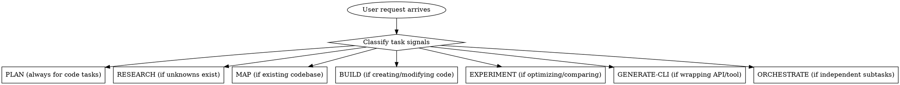
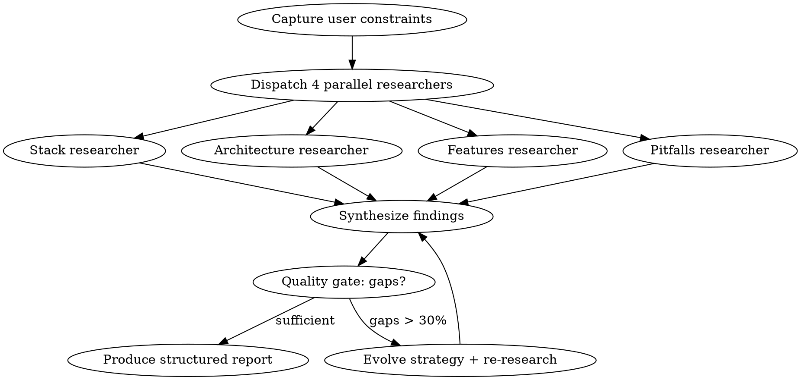

# Super - Autonomous Task Engine

When `/super` is invoked (or this skill activates), **do not ask which sub-command to use.** Analyze the user's request and autonomously activate the right combination of capabilities. The GSD planning backbone (discuss -> plan -> verify) is always active for any task that involves writing code or making changes.

## Autonomous Router



### Classification Rules

Read the user's request and activate capabilities based on these signals. **Multiple capabilities activate together** -- this is not pick-one.

| Signal in the request | Activates | Why |
|----------------------|-----------|-----|
| Any task involving code changes | **PLAN** (always) | GSD backbone: discuss gray areas, create verified atomic tasks, wave-based execution |
| Unknowns, options to evaluate, "which/what/how should we" | **RESEARCH** | Need information before committing to an approach |
| Working in an existing codebase the agent hasn't mapped | **MAP** | Must understand what exists before modifying it |
| Creating features, fixing bugs, building systems | **BUILD** | Multi-phase pipeline with quality gates |
| "Faster", "optimize", "improve", "try different approaches" | **EXPERIMENT** | Scientific iteration loop with keep/discard tracking |
| "Wrap this API", "make a CLI for", "scriptable interface" | **GENERATE-CLI** | Auto-generate CLI from schema/source |
| 2+ independent tasks, "audit all", "do X for each" | **ORCHESTRATE** | Parallel agent fan-out |

### Typical Combinations

| User says | What activates | Flow |
|-----------|---------------|------|
| "Add user authentication to this app" | MAP -> PLAN -> BUILD | Map codebase, plan with gray-area discussion, build through phases |
| "What's the best database for our use case?" | RESEARCH | Iterative research with parallel agents |
| "Build a notification system" | MAP -> RESEARCH -> PLAN -> BUILD | Map existing code, research approaches, plan, then build |
| "Make this endpoint faster" | MAP -> PLAN -> EXPERIMENT | Map context, plan approach, iterate with measurements |
| "Audit security across all 5 services" | ORCHESTRATE (with MAP per service) | Parallel fan-out, each agent maps + audits its service |
| "Create a CLI for our internal API" | PLAN -> GENERATE-CLI | Plan the interface, then generate it |
| "Refactor the billing module to use events" | MAP -> RESEARCH -> PLAN -> BUILD | Full pipeline: understand, research patterns, plan, execute |
| "Compare CRDT vs OT for our editor" | RESEARCH -> PLAN | Research both, then plan the chosen approach |

### When in doubt

- If the task changes code: **PLAN is always on.** No code without a verified plan.
- If there's an existing codebase: **MAP first** (unless already mapped this session).
- If you're unsure about the right approach: **RESEARCH before PLAN.**
- If there are independent subtasks: **ORCHESTRATE** wraps the other capabilities.

### Announce what you're activating

Before starting work, briefly tell the user which capabilities you're activating and why:

```
Activating: MAP -> RESEARCH -> PLAN -> BUILD
- MAP: This is an existing Next.js project, need to understand patterns first
- RESEARCH: Event-driven architecture has multiple approaches worth comparing
- PLAN: Will create verified atomic tasks before coding
- BUILD: Multi-phase implementation with quality gates
```

---

## Artifact Persistence (.super/ directory)

All `/super` work is persisted to a `.super/` directory in the working directory. This survives context resets and enables resume across sessions.

### Directory Structure

```
.super/
  state.json          # Auto-maintained by hook: capabilities activated, artifact timestamps
  research.md         # RESEARCH output: stack, architecture, features, pitfalls, don't-hand-roll
  plan.md             # PLAN output: atomic tasks with waves, verification criteria, dependencies
  experiments.md      # EXPERIMENT output: baseline, hypothesis log, results table
  map-tech.md         # MAP output: stack analysis
  map-architecture.md # MAP output: architecture analysis
  map-quality.md      # MAP output: quality analysis
  map-concerns.md     # MAP output: concerns analysis
```

### When to Write Artifacts

- **Always write** research, plan, and map outputs to `.super/` files
- **Always write** experiment logs as they progress
- The `super-research-tracker` hook automatically updates `state.json` when artifacts are written
- The `super-plan-guard` hook warns if source code is being edited without `.super/plan.md` existing

### Resuming Across Sessions

When `/super` activates, check for existing `.super/` directory:
1. If `state.json` exists, read it to understand what was already done
2. Skip capabilities whose artifacts already exist (e.g., don't re-MAP if `map-tech.md` exists)
3. Resume from where the previous session left off

### Enforcement Hooks (registered in settings.json)

| Hook | Event | What It Enforces |
|------|-------|-----------------|
| `super-plan-guard.js` | PreToolUse (Write/Edit) | Warns if editing source code without `.super/plan.md` existing |
| `super-research-tracker.js` | PostToolUse (Write) | Tracks artifact writes, updates `state.json`, validates artifact quality |
| `gsd-context-monitor.js` | PostToolUse | Warns at 35%/25% remaining context (shared with GSD) |
| `gsd-prompt-guard.js` | PreToolUse | Scans for prompt injection in planning files (shared with GSD) |

### Artifact Quality Validation

The research tracker hook checks that artifacts contain expected markers:
- **research.md** must contain confidence tags (`[HIGH]`, `[MEDIUM]`, `[LOW]`)
- **plan.md** must contain `Verify:` and `Dependencies:` markers
- **experiments.md** must contain `Baseline` and `Hypothesis` markers

If markers are missing, an advisory warning is injected so the agent can fix the artifact.

---

## PLAN (GSD Backbone -- Always Active for Code Tasks)

**From: GSD (discuss -> plan -> verify -> execute with context freshness)**

This is the foundation. Every task that produces code goes through this cycle.

### Discuss: Surface Gray Areas

Before planning, identify decisions that affect implementation:
- **Visual features?** Ask about layout, responsive behavior, interactions
- **API work?** Ask about error handling, auth, rate limiting
- **Data model?** Ask about relationships, constraints, migration strategy
- Lock decisions into a context document so downstream work doesn't re-debate them
- If the user said `/super` with enough context that gray areas are obvious, surface them in a concise list rather than an extended Q&A

### Plan: Create Atomic Tasks

Each task specifies:
- **Name**: What this task accomplishes
- **Files**: Which files will be created or modified
- **Action**: Precise implementation steps
- **Verify**: How to confirm the task succeeded
- **Dependencies**: Which tasks must complete first

### Verify: Check Before Executing

Before writing any code, verify the plan against:
1. Every requirement has at least one task covering it
2. Tasks are atomic (one concern each, independently testable)
3. Dependencies correctly ordered (no circular, no missing)
4. Scope is achievable, not over-ambitious
5. No gaps between what was asked and what's planned

Max 3 revision loops. If it can't pass, escalate to user.

### Execute: Wave-Based with Fresh Contexts

Group tasks into dependency waves:
- **Wave 1**: All tasks with no dependencies (run in parallel)
- **Wave 2**: Tasks depending only on Wave 1 (parallel after Wave 1)
- Each task gets a fresh agent context (prevents context rot)
- Each completed task produces an atomic git commit: `feat(wave-task): description`

### Human Checkpoint

Pause after planning for user approval. Be autonomous during execution, but surface problems immediately rather than working around them silently.

---

## RESEARCH (Deep Domain Investigation)

**From: AutoResearch (autonomous loop) + OpenSpace (evolving strategy) + GSD (4-domain parallel research, expert modeling, pitfall-driven investigation)**

Activated when there are unknowns, options to evaluate, or decisions to inform. This is not a library lookup -- it's expert modeling: "how do experts build this?"

### Protocol



### Step 1: Capture Constraints

Before researching, lock what's already decided:
- **User decisions** from the discuss phase are NON-NEGOTIABLE -- research works within them
- **Areas of discretion** where research can recommend freely
- **Out of scope** items to ignore

### Step 2: Parallel 4-Domain Research

Dispatch 4 parallel agents, each investigating one domain:

| Agent | Investigates | Produces |
|-------|-------------|----------|
| **Stack** | Libraries, frameworks, versions, alternatives with tradeoffs, installation commands | Recommended stack with specific versions and "why standard" reasoning |
| **Architecture** | Project structure, named patterns with conditions, code examples from official sources, anti-patterns to avoid | Architecture recommendation with real code from authoritative sources |
| **Features** | What users expect (table stakes vs differentiators vs defer-to-v2), competitive landscape | Prioritized feature list: must-have, should-have, defer |
| **Pitfalls** | What goes wrong, root causes, prevention strategies, warning signs for early detection | Pitfall list with "how to avoid" AND "how to detect early" |

### Step 3: Don't Hand-Roll Analysis (from GSD)

A critical output of research. Explicitly identify problems that *look simple but aren't*:

| Problem | Don't Build | Use Instead | Why |
|---------|-------------|-------------|-----|
| (looks simple) | (custom code) | (existing solution) | (edge cases you'd miss) |

This prevents custom implementations that introduce bugs and maintenance burden. Research identifies what experts DON'T build themselves.

### Step 4: Synthesize + Quality Gate

Merge findings across all 4 domains. Tag confidence per section:

| Confidence | Meaning | Source Type |
|------------|---------|-------------|
| `[HIGH]` | Verified with official sources, docs, or authoritative code | Primary: official docs, Context7 |
| `[MEDIUM]` | Multiple community sources agree | Secondary: verified web sources |
| `[LOW]` | Single source or inference, needs validation | Tertiary: needs validation during implementation |

If gaps > 30%, evolve strategy and loop (max 3 iterations). Each iteration must reduce gaps or stop.

### Step 5: Validation Architecture

Research also produces HOW to verify the implementation succeeded:
- What tests prove the chosen approach works
- What metrics indicate success
- What warning signs indicate the approach is failing

This feeds directly into the PLAN's verification criteria.

### Output Structure

```markdown
## Research: <topic>

### User Constraints (locked)
- [decisions from discuss phase -- non-negotiable]

### Executive Summary
[2-3 paragraphs: what was researched, recommended approach, key risks]
**Primary recommendation:** [one-liner actionable guidance]

### Recommended Stack
| Technology | Version | Purpose | Why Standard |
|-----------|---------|---------|--------------|
[Specific versions, not just names]

### Architecture Patterns
[Named patterns with conditions and code from official sources]
**Anti-patterns to avoid:** [with reasoning]

### Don't Hand-Roll
| Problem | Don't Build | Use Instead | Why |
|---------|-------------|-------------|-----|
[What experts DON'T build themselves]

### Feature Priorities
- **Must-have (table stakes):** [users expect this]
- **Should-have (competitive):** [differentiators]
- **Defer (v2+):** [not essential for launch]

### Critical Pitfalls
For each: what goes wrong, root cause, prevention, warning signs

### Validation Architecture
[How to verify the implementation succeeds]

### Confidence Assessment
| Area | Confidence | Notes |
|------|------------|-------|
[Per-section confidence so planner knows what needs extra validation]

### Open Questions
[Gaps that couldn't be resolved + how to handle during implementation]

### Sources
- **Primary (HIGH):** [official docs, authoritative]
- **Secondary (MEDIUM):** [community, multiple sources agree]
- **Tertiary (LOW):** [single source, needs validation]

### Strategy Evolution Log
[How research strategy adapted across iterations]
```

### Anti-Loop Guard

- Max 3 iterations; each must reduce gaps
- Abort on diminishing returns (< 10% new findings per iteration)

### Output feeds into PLAN

Research findings become input context for planning. Locked decisions carry forward. Don't-hand-roll list prevents the planner from reinventing solved problems. Pitfalls become verification criteria. Confidence gaps become areas needing extra testing.

---

## MAP (Brownfield Analysis)

**From: GSD (parallel codebase mappers)**

Activated when working in an existing codebase. Skip if already mapped this session.

### Protocol

Dispatch 4 parallel agents:

| Agent | Focus |
|-------|-------|
| **Tech** | Stack, frameworks, dependencies, versions |
| **Architecture** | Directory structure, patterns, data flow |
| **Quality** | Test coverage, lint config, CI/CD, conventions |
| **Concerns** | Tech debt, security issues, performance risks |

### Output feeds into PLAN and BUILD

Map results inform planning (match existing patterns) and building (follow existing conventions). The rule: **respect what exists.** Match code style, use existing abstractions, understand the test strategy before writing tests differently.

---

## BUILD (Multi-Phase Pipeline)

**From: CLI-Anything (7-phase) + OpenSpace (quality monitoring)**

Activated when creating or modifying code. Always preceded by PLAN.

### Phases

| Phase | Deliverable | Gate |
|-------|-------------|------|
| 1. Analyze | Requirements + acceptance criteria | All requirements have criteria |
| 2. Design | Architecture decisions, interfaces | User confirms |
| 3. Implement | Working code, atomic commits | Compiles/runs clean |
| 4. Test | Test suite passing | Acceptance criteria covered |
| 5. Refine | Gap analysis: spec vs result | No gaps or gaps documented |
| 6. Document | Only if user requests | -- |
| 7. Deliver | Final summary | User confirms |

### Quality Monitoring (3 layers)

- **Task**: Is each task meeting its criteria?
- **Integration**: Do components work together?
- **Goal**: Does the whole thing solve the original problem?

Stop and fix if quality degrades at any layer.

### Iterative Refinement

After testing, run gap analysis: what was requested but not built? What edge cases were missed? What could be simplified? Each refinement cycle is additive and non-destructive.

---

## EXPERIMENT (Scientific Iteration)

**From: AutoResearch (autonomous loop with time budgets)**

Activated when optimizing, comparing approaches, or tuning performance.

### Protocol

1. **Baseline** - Measure current state
2. **Hypothesize** - State expected change and why
3. **Implement** - Make the change (git commit)
4. **Measure** - Same evaluation as baseline
5. **Decide**: Better = keep. Worse = reset. Crashed = reset + adjust.
6. **Loop** - Max 5 experiments before reassessing strategy

### Constraints

- One hypothesis per experiment (never bundle)
- Simpler wins when results are comparable
- Track all attempts in a results log (including discarded ones)

---

## GENERATE-CLI (Tool Interface Creation)

**From: CLI-Anything + Google Workspace CLI (schema-driven)**

Activated when wrapping an API, codebase, or software in a CLI.

### Pipeline

1. **Discover** - Read schema (OpenAPI, GraphQL, Discovery docs) or source code
2. **Design** - Map to CLI commands grouped by resource. `+` prefix for convenience helpers. `--json` on everything.
3. **Implement** - Generate CLI (Click/Python or commander/Node). Self-describing via `--help`. Consistent exit codes.
4. **Test** - Run against real backend
5. **Document** - Auto-generate SKILL.md for agent discovery

### Principles

- Real backend, no reimplementation
- Dual output: human-readable default, `--json` for machines
- Schema-driven when schema exists

---

## ORCHESTRATE (Parallel Fan-Out)

**From: Claude Peers (multi-agent) + OpenSpace (quality monitoring)**

Activated when there are 2+ independent tasks. Wraps other capabilities -- each parallel agent can run its own MAP/PLAN/BUILD internally.

### Protocol

1. **Decompose** - Identify independent tasks (must not share state)
2. **Dispatch** - One agent per task with complete, self-contained prompt
3. **Collect** - Gather structured results
4. **Synthesize** - Deduplicate, resolve conflicts, identify gaps, score confidence
5. **Retry** - Failed agents get one retry with adjusted prompt; then report partial results

---

## Cross-Cutting Principles (Always Active)

### Context Freshness (from GSD)
- Fresh agent context per substantial task (prevents rot)
- Materialize decisions into documents, not conversation history
- Thin orchestrator, fat agents -- heavy work in fresh contexts

### Git as Memory (from AutoResearch)
- Atomic commits per task: `feat(wave-task): description`
- Reset on failure, commit on success
- The git log is the experiment journal

### Self-Evolving Strategy (from OpenSpace)
- If an approach isn't working, pivot -- don't persist
- Log strategy changes so the user can see reasoning
- Max 3 iterations on any loop (anti-runaway)

### Simplicity Criterion (from AutoResearch)
- Simpler wins when results are comparable
- Removing code for equal results is always a win
- Complexity must justify itself with measurable improvement

### Structured Output (from Google Workspace CLI)
- Tables for comparisons
- Confidence tags: `[VERIFIED]` `[INFERRED]` `[ASSUMED]`
- Clear sections, actionable next steps

### Verify Before Execute (from GSD)
- Plans checked before execution, not just after
- Requirement coverage, atomicity, dependencies, scope
- Max 3 revision loops; escalate if still failing

### Brownfield First (from GSD)
- Map before modifying
- Match existing patterns
- Use existing abstractions before creating new ones
